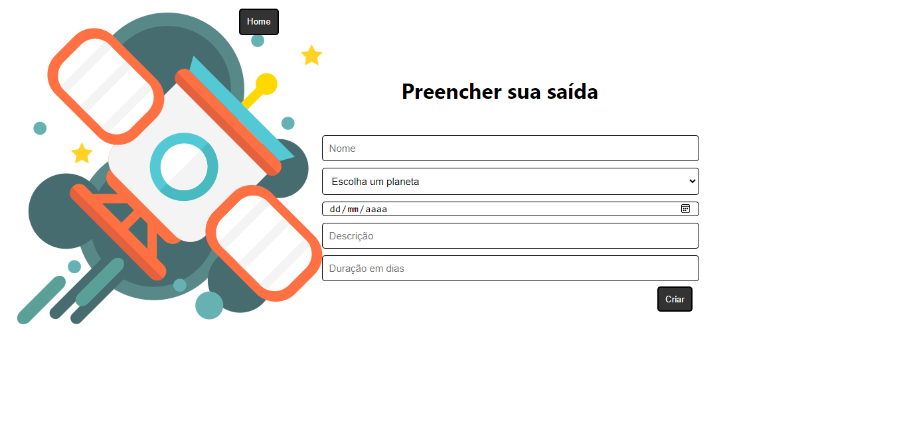

# 👨‍🚀 LabeX 
#### Gerenciamento e candidatura de viagem espacial.

###### https://upset-cobweb.surge.sh/
### Tecnologias utilizadas

- React
- Styled-components
- axios
- Router

#### ✅ O que funciona
 - Requisições API LabeX
 - Login (Logar como administrador)
 - List Trips (Inscreva-se)
 - Application Form (Formulário)
 - Create Trip (Criar uma viagem)
 
 
#### ❌ O que não funciona
 - Não existe a Page Admin Home
 - Não existe a Page Trip Details  

### Layout

###### E-mail: roberta.vieirademelo@yahoo.com.br
###### Senha: 456357